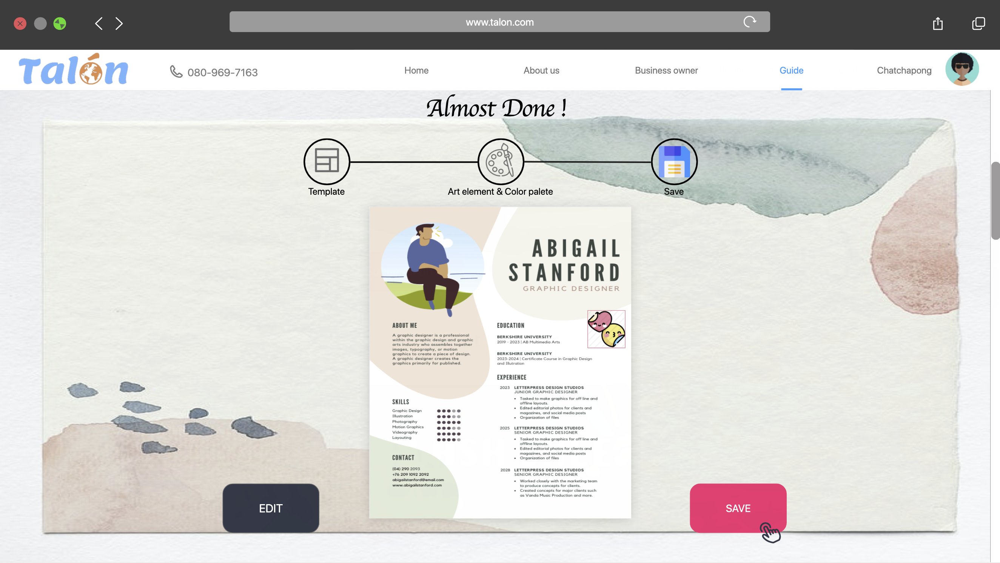

# 2020-ITCS371-1-Auttama

Mr. Sarun Junbang 6188080

Mr. Chatchapong Mingmongkhol 6188103

Miss Thananya Chattranusorn 6188106

Mr. Piyakorn Suwannakarn 6188110

Miss Kanittha Cheiochansilp 6188125

Miss Ornpicha Arunsangsil 6188136                                                                                                                                                                                                                                                                                                                                                                                                                                                                                                                                                                                                                                                                                                                                                                                                                                                                                                                                                                                                                                                                                                                                                                                                                                                                                                                                                                                                                                                                                                                                                                                                                                                                                                                                                                                                                    
# Functional decomposition diagram

https://drive.google.com/file/d/19e39lP4uhD_6t_VZtuuK6U3C_30wjy4b/view?usp=sharing

# Data Flow Diagram Level 1

https://drive.google.com/file/d/19jy3U-yhA8FhxnVtbv98kW-ka8hFX0Dw/view?usp=sharing

# Data Flow Diagram Level 2 of all process

# Payment

# Write trip journal

# Prepare trip

# Feedback

# Sign up

# Report issue

# Create Profile

# Create Trip

# Unique storytelling

# Promotion

# Entity Relationship diagram (ERD)

https://drive.google.com/file/d/1MPHn8ZzuahOuT5o2eWuF5cLQnUPm9MPG/view?usp=sharing
# Mock-up prototype

